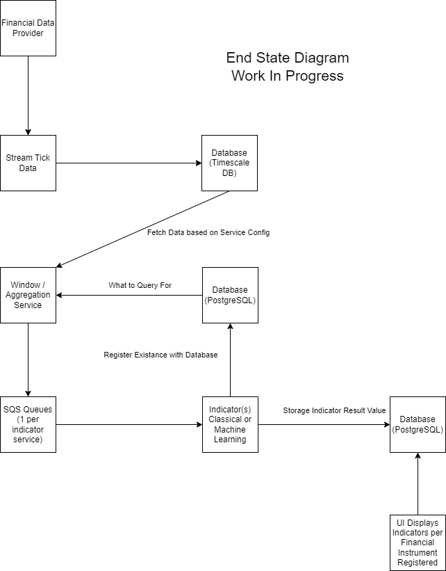

# project-foresight

## Description

Overall, this architecture facilitates the continuous flow of data from ticket sources to the user interface, with various microservices handling data ingestion, aggregation, calculations, storage, and presentation. It provides a scalable and maintainable solution for processing and visualizing ticket-related indicators.

### Ticket Data Fetch Service (Microservice 1)

- Responsibility: This microservice is responsible for fetching ticket data from various sources and writing it to a time series database, specifically Timescale DB.
- Functionality: It periodically queries external ticket data sources, processes the fetched data, and inserts it into the Timescale DB. The data includes information about events, timestamps, and relevant ticket details.
- Technology Stack: Python, Timescale DB, Database Connector, Background Streaming Task.

### Windowed Aggregate Data Service (Microservice 2)

- Responsibility: This microservice is tasked with pulling data regularly from the Timescale DB and calculating windowed aggregate statistics.
- Functionality: It retrieves data from the time series database at scheduled intervals, applies aggregation operations (e.g., sum, average) over specified time windows, and then sends the aggregated results to other services via Amazon Simple Queue Service (SQS).
- Technology Stack: Python, Timescale DB Connector, Scheduler, Amazon SQS Connector.

### Indicator Calculation Services (Microservices 3 - N) -- WIP (only one indicator service implemented)

- Responsibility: These microservices are responsible for consuming aggregated data from the SQS queue and performing more complex calculations to generate indicators then storing them in a PostgreSQL database.
- Functionality: Each service subscribes to the SQS queue and processes incoming aggregated data. Depending on the specific calculation logic, they perform statistical or analytical operations on the data to create meaningful indicators. The resulting indicators are then stored in a PostgreSQL database.
- Technology Stack: Python, Amazon SQS Connector, PostgreSQL, Database Connector, Indicator Calculation Logic.

### UI Service (Microservice N+1) -- WIP

- Responsibility: This microservice serves as the user interface for displaying the latest indicators to end users.
- Functionality: It retrieves the latest indicators from the PostgreSQL database and presents them in a user-friendly format through a web or application interface. Users can interact with the UI to view and analyze the indicator data.
- Technology Stack: Python, Web Framework, PostgreSQL Connectors.

## Development Environment Setup

### Python Setup

[Install Python 3.11^](https://www.python.org/downloads/release/python-3112/)

[Install Poetry](https://python-poetry.org/docs/#installation)

(Optional) Enable Local Poetry Virtual Env Globally

```bash
poetry config virtualenvs.in-project true
```

### Docker Setup

Used for local development and testing (localstack for AWS and Timescale DB for the database)

[Install Docker](https://docs.docker.com/get-docker/)

#### Local Services

The following sets up

- Localstack (AWS)
- Timescale DB (PostgreSQL)
- pre-commit

```bash
docker-compose up -d
```

### Deploy Services

Deploy the following services in the order listed below, after docker is running. Eventually everything will be deployed via docker-compose.

```bash
# Install dependencies
poetry install

# Activate environment
poetry shell

# Deploy services
python stream_service/app.py
python window_service/app.py
python indicator_service/moving_average_indicator.py
python interface_service/app.py
```

## End State Architecture

This is the end-goal and a work in progres (subject to change).



## Progress Shots

### Dashboard

Showing all indicators in realtime and their stats + bullish or bearish


### Simple Moving Average

Updates in realtime and refreshes as new data comes in


